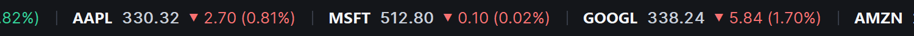

# StockRock

A tiny native Windows stock ticker: a slim, smoothly scrolling tape of prices that you can pin on
top of everything with PowerToys. Written in Rust on raw Win32/GDI: no UI framework, no browser
engine, no runtime to install.



|        |                                                                                  |
| ------ | -------------------------------------------------------------------------------- |
| Memory | ~2-4 MB private working set (the number Task Manager shows), 5-13 MB including shared system DLLs |
| CPU    | ~1% of one core while scrolling at 60 fps, ~0% when static, minimized or hovered |
| Binary | one ~0.5 MB `.exe`, no installer, no VC++ redistributable                        |

## Run

```powershell
cargo run --release            # or double-click target\release\stockrock.exe
```

Only one instance runs at a time: launching it again just raises the existing window.

## Using it

- **Move**: drag anywhere on the bar. **Resize**: drag the left or right edge (the height follows
  the font size). Position and width are remembered.
- **Hover** to pause the scroll so you can read it. If everything fits in the window, it doesn't
  scroll at all.
- **Right-click** for: Refresh now, Pause scrolling, Edit config..., Exit.
- **Pin on top**: focus the ticker and press <kbd>Win</kbd>+<kbd>Ctrl</kbd>+<kbd>T</kbd>
  (PowerToys Always On Top).
- The window title (taskbar hover / Alt-Tab) shows when prices last updated, or what went wrong.
- Prices that failed their latest refresh stay on screen but are dimmed gray, so stale data never
  looks live.

## Configuration

`%APPDATA%\StockRock\config.toml` is created on first run, and changes are picked up within a
couple of seconds of saving. Mistakes are shown on the ticker itself with the offending line.

```toml
symbols = ["AAPL", "MSFT", "GOOGL", "AMZN", "NVDA", "TSLA", "META", "^GSPC", "^IXIC", "BTC-USD"]
refresh_seconds = 30     # minimum 5
scroll_speed = 60        # pixels/second at 100% scaling; 0 = never scroll
font_size = 13           # points
fps = 60                 # lower = less CPU while scrolling
pause_on_hover = true
```

Symbols use Yahoo Finance notation: stocks (`AAPL`), indices (`^GSPC`), crypto (`BTC-USD`), forex
(`EURUSD=X`), futures (`GC=F` gold, `CL=F` WTI crude, `BZ=F` Brent crude). The list order is the
order on the ticker.

An optional `[names]` section gives a symbol a friendlier label on the ticker, for example `Brent`
instead of `BZ=F`:

```toml
symbols = ["AAPL", "BZ=F", "^GSPC"]

[names]
"BZ=F" = "Brent"
"^GSPC" = "S&P 500"
```

Symbols are matched case-insensitively, a name keeps its capitalization, and symbols without a name
are shown as they are. Keep `[names]` at the end of the file: TOML puts every key below a `[header]`
inside that table.

**Brent oil:** add `"BZ=F"` to `symbols`, as above. Yahoo has no CFD quotes (a CFD is a broker's
product, so its price only comes from that broker); `BZ=F` is the Brent futures price that Brent
CFDs track. It should be close to a broker's quote but can differ a little, notably around contract
rollovers.

**BlackBull Markets prices:** write the symbol as `blackbull:` plus BlackBull's instrument name to
read the price from BlackBull's own public feed (the one their instrument pages use), for example
`"blackbull:BRENT"` for Crude Oil Brent (Cash) or `"blackbull:XAUUSD"` for gold. It shows the sell
(bid) price. That feed has no previous close, so these symbols show the price without a change
figure.

```toml
symbols = ["AAPL", "blackbull:BRENT"]

[names]
"blackbull:BRENT" = "Brent Cash"
```

To start with Windows, put a shortcut to the exe in the folder opened by <kbd>Win</kbd>+<kbd>R</kbd>
→ `shell:startup`.

## Data source

Quotes come from Yahoo Finance's public chart endpoint, which needs no API key (and, for
`blackbull:` symbols, from BlackBull's public price feed). Both are
**unofficial**: they can change or rate-limit without notice, and prices may be delayed. Shown prices
are the regular-session price; the change is relative to the previous close. All of the provider
specifics live in [`src/quotes.rs`](src/quotes.rs), so swapping in another source is a local change.

## Build

Needs the Rust toolchain (MSVC target) and the Visual Studio C++ build tools.

```powershell
cargo build --release          # -> target\release\stockrock.exe
cargo test
```

## Why it's light

- **GDI, not a GPU stack.** Direct2D/WebView/egui-style renderers load the graphics driver and
  cost tens of MB. Here the whole tape is drawn once into an off-screen bitmap whenever the data or
  window size changes; each scroll frame is a single `BitBlt`.
- **Nothing runs when nothing moves.** The frame timer thread is parked unless the tape is
  scrolling, visible, and not hovered. When static there is only a 1 Hz housekeeping tick and a
  refresh every `refresh_seconds`.
- **WinHTTP**, built into Windows, instead of bundling a TLS stack and certificate store (it also
  follows the system proxy settings).
- A release build is size-optimized, LTO'd and statically linked against the C runtime.

## Layout

| File                 | Role                                                                  |
| -------------------- | --------------------------------------------------------------------- |
| `src/app.rs`         | Window, message handling, menu, placement                             |
| `src/render.rs`      | Tape layout and drawing                                               |
| `src/anim.rs`        | Frame pacing thread                                                   |
| `src/worker.rs`      | Polling thread (fetch, merge, back off on failure)                    |
| `src/quotes.rs`      | Yahoo chart endpoint client and parser                                |
| `src/winhttp.rs`     | Minimal HTTPS GET                                                     |
| `src/config.rs`      | `config.toml` and saved window placement                              |
| `src/icon.rs`        | Window icon, generated at runtime                                     |
